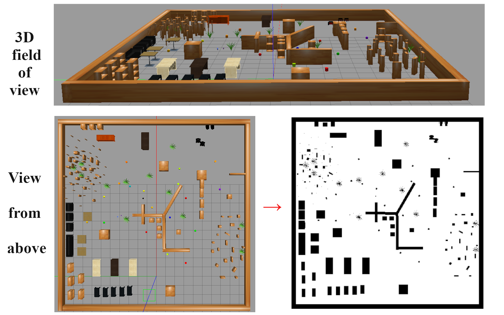
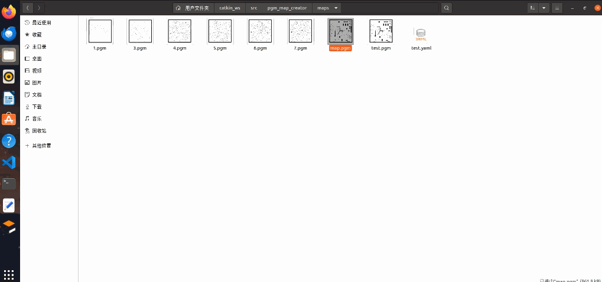
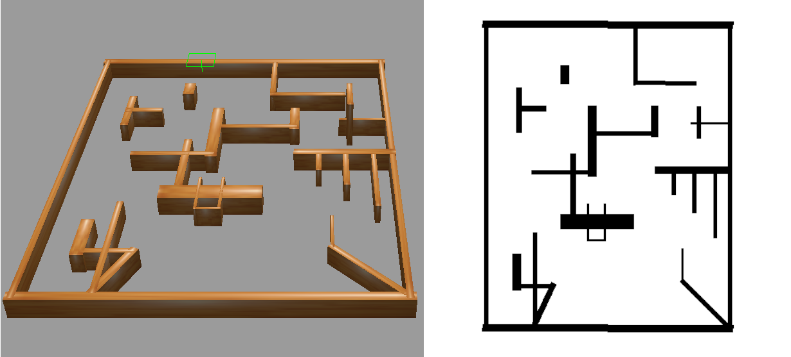

# 1、pgm_map_creator **Project Overview**
This project is designed to generate PGM maps directly from Gazebo .world files. The generated PGM maps can be used as ground truth maps for testing the performance of SLAM algorithms. Additionally, they can serve as prior global maps for path planning algorithms.

Below are the results generated by the example environment provided by the project.



<p align="center">
    
    
</p>


## (1) Features
① Ground Truth Maps: Create accurate PGM maps for evaluating SLAM algorithm performance.  

② Prior Global Maps: Utilize the generated maps directly for path planning algorithms.  

③ High-Quality Mapping: Produce high-quality prior maps for scenarios where SLAM algorithm performance is suboptimal or when using SLAM is inconvenient.  

④ Convenience and Efficiency: Generate the necessary maps quickly and easily, enhancing the workflow of path planning tasks.

## (2) Use Cases
① Testing SLAM Algorithms: Evaluate and benchmark the performance of SLAM algorithms using the generated ground truth maps.  

② Path Planning: Employ the generated PGM maps as prior global maps to improve the efficiency and accuracy of path planning algorithms.  

③ Challenging Environments: Use this project to generate high-quality global maps in environments where SLAM algorithms may struggle or are impractical to deploy.

## (3) Testing Environment

**Ubuntu 20.04, ROS Noetic, Boost 1.71，Gazebo 11, C++ 17**


## (4) Contribution Details

This project is based on the open-source `pgm_map_creator` project by hyfan1116, available at: [pgm_map_creator](https://github.com/hyfan1116/pgm_map_creator). Due to updates in ROS, Boost, and Gazebo versions, the original project is no longer functional. Our main contribution is updating and fixing the project to ensure compatibility with Ubuntu 20.04, ROS Noetic, Boost 1.71, Gazebo 11, and C++ 17, allowing it to run smoothly in these environments. We extend our gratitude to hyfan1116 for the original `pgm_map_creator` project.


# 2、**Project Installation**


##  (1) Install the dependencies.

```bash
sudo apt-get update
```

```bash
sudo apt-get install libboost-all-dev protobuf-compiler
```

## (2) Clone the Package to your ROS workspace `src` folder:

**Method 1**: Use the following command to quickly clone the package. Note that the default ROS workspace name is `catkin_ws`. If your workspace has a different name, please modify `catkin_ws` accordingly in the command below.

```bash
cd ~/catkin_ws/src/
git clone https://github.com/JZX-MY/pgm_map_creator
```

**Method 2**: Manually download the project's source code as a zip file, then copy it to your ROS workspace's `src` folder and extract it.


## (3) Build the Package (First Compilation)

To ensure the project works correctly, it needs to be compiled twice. First, navigate to your ROS workspace and compile the package:

```bash
cd ~/catkin_ws/
catkin_make -DCATKIN_WHITELIST_PACKAGES="pgm_map_creator"
  ```
## (4) Modify CMakeLists.txt

Open the `CMakeLists.txt` file located in the `pgm_map_creator/msgs` directory and comment out the following three lines, then save the changes:

```bash
${PROTOBUF_IMPORT_DIRS}/vector2d.proto
${PROTOBUF_IMPORT_DIRS}/header.proto
${PROTOBUF_IMPORT_DIRS}/time.proto
```

The modified `CMakeLists.txt` file should look like this:

```bash
find_package(Protobuf REQUIRED)

set(PROTOBUF_IMPORT_DIRS)
foreach(ITR ${GAZEBO_INCLUDE_DIRS})
  if(ITR MATCHES ".*gazebo-[0-9.]+$")
    set(PROTOBUF_IMPORT_DIRS "${ITR}/gazebo/msgs/proto")
  endif()
endforeach()

set (msgs
  collision_map_request.proto
  #${PROTOBUF_IMPORT_DIRS}/vector2d.proto
  #${PROTOBUF_IMPORT_DIRS}/header.proto
  #${PROTOBUF_IMPORT_DIRS}/time.proto
)

PROTOBUF_GENERATE_CPP(PROTO_SRCS PROTO_HDRS ${msgs})
add_library(collision_map_creator_msgs SHARED ${PROTO_SRCS})
target_include_directories(collision_map_creator_msgs PUBLIC ${PROTOBUF_INCLUDE_DIRS})
target_link_libraries(collision_map_creator_msgs ${PROTOBUF_LIBRARY})
```

## (5) Build the Project (Second Compilation)

After modifying the `CMakeLists.txt` file, perform the second compilation:

```bash
catkin_make -DCATKIN_WHITELIST_PACKAGES="pgm_map_creator"
```


# 3、**Verify if the Package is Functioning Correctly.**

To verify if the package is functioning correctly, please execute the following two commands in sequence for testing.

```bash
roslaunch pgm_map_creator open_world.launch
```

```bash
roslaunch pgm_map_creator request_publisher.launch
```

After the program runs successfully, a file named `map.pgm` will be generated in the `maps` folder, as shown in the dynamic demonstration of the testing process below:


<div align="center">
  
</div>


Note that the example environment mentioned above includes some third-party models. If these models are not downloaded on your computer, the Gazebo environment you open may be missing some parts compared to the illustrations above. Additionally, since the system may keep searching for the missing files, the time taken to open Gazebo could be longer. Taking this into consideration, we have added a new, simpler test example that does not include any third-party models, named 'test2.world'. Additionally, we have changed the default test file to this new file,as shown in the dynamic demonstration of the testing process below:.





# 4、**How to Use in Your Own .World File**

## (1) Copy your `.world` file to the `worlds` folder of the `pgm_map_creator` package.

## (2) Add the plugin to the .world file.

Add the following code to your own `.world` file, just before the `</world>` tag.

```xml
<plugin filename="libcollision_map_creator.so" name="collision_map_creator"/>
```

## (3) Modify the `open_world.launch` file


Open the `open_world.launch` file in the `launch` folder of the `pgm_map_creator` package, and change the referenced `.world` file to your own `.world` file. Replace `test.world` in the following line with the name of your own `.world` file and save the changes:

```xml
<arg name="world_file" default="$(find pgm_map_creator)/worlds/test.world"/>
```

## (4) Modify the `request_publisher.launch` file


Open the `request_publisher.launch` file in the `launch` folder of the `pgm_map_creator` package. Based on your `.world` file, set the relevant parameters for the mapping area range: `xmin`, `xmax`, `ymin`, `ymax`, and the map resolution `resolution`. The commonly used default value for resolution is 0.05.


## (5) Use the `pgm_map_creator` package to generate the map

After making the above modifications, you can now execute the following two commands sequentially to generate the pgm map file for your own `.world` file:

```bash
roslaunch pgm_map_creator open_world.launch
```

```bash
roslaunch pgm_map_creator request_publisher.launch
```


Wait for the plugin th generate map. Track the progess in the terminal that spawns the world file. Once it is done, the pgm map would be in the `maps` folder of the `pgm_map_creator`.


## (6) Create the `yaml` file for the pgm map.

You may also need a `yaml` file which provides the metadata of the map.

```
cd catkin_ws/src/pgm_map_creator/maps
touch map.yaml
```
`map.yaml`
```
image: map.pgm
resolution: 0.01
origin: [-5.0, -12.0, 0.0]
occupied_thresh: 0.65
free_thresh: 0.196
negate: 0
```

The parameters `resolution` and `origin` are based on the arguments in `request_publisher.launch`.The `image` parameter is the name of the map generated in the previous step. If you manually renamed the map, you need to update this parameter accordingly. In our provided example, it has been manually renamed to `test.pgm`. Alternatively, you can modify the `map_name` parameter in the `request_publisher.launch` file to directly generate a pgm map with the specified name.


# 5、**Acknowledgments**


This project is based on the open-source `pgm_map_creator` project by hyfan1116, available at: [pgm_map_creator](https://github.com/hyfan1116/pgm_map_creator). Due to updates in ROS, Boost, and Gazebo versions, the original project is no longer functional. Our main contribution is updating and fixing the project to ensure compatibility with Ubuntu 20.04, ROS Noetic, Boost 1.71, Gazebo 11, and C++ 17, allowing it to run smoothly in these environments. We extend our gratitude to hyfan1116 for the original `pgm_map_creator` project.


 

